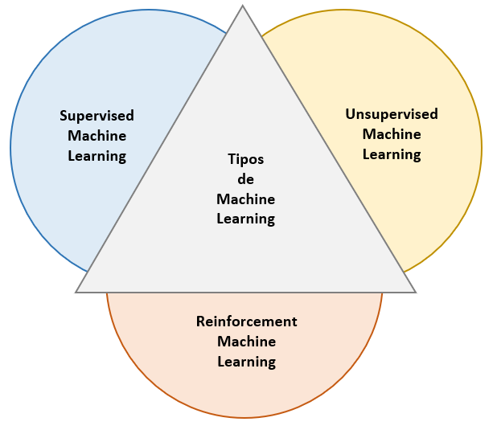
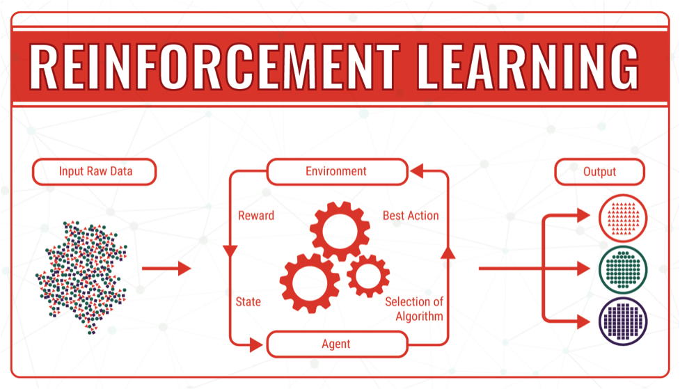

# Niveles de la Inteligencia Artificial

El presente trabajo busca definir correctamente los términos _Machine, Deep, Supervised, Unsupervised y Reinforcement Learning_, usados extensamente en la ciencia de la Inteligencia Artifical. Es importante conocer correctamente sus definiciones para saber en qué pueden o no ser usados y cuáles son los mecanismos internos con los que operan.

En su sentido más amplio, la inteligencia artifical abarca campos como la matemática, la estadístico e informática que estudia
la forma de construir programas y máquinas _inteligentes_, capaces de resolver problemas de manera creativa y autónoma.
Las cuales siempre fueron consideradas exclusivas de la naturaleza humana. Dicho problema ha tratado de ser resuelto de diferentes formas a través del tiempo, y mientras más complejo se hacía más subcampos se abrían. Es por eso que puede entenderse al _Machine Learning_ y al _Deep Learning_ como parte de estos subcampos. 

  

## _Machine Learning_
Este primer subcampo de la IA se encarga de construir algoritmos que enseñen a un 
ordenador a _aprender_ automáticamente a resolver un problema y que a través de la experiencia puedan
mejorar su rendimiento. Para esto, el algoritmo utiliza un reglas que permitan a la computadora a encontrar
patrones en un gran número de ejemplos que incluyen el resultado que se desea y luego de dicho entrenamiento, el
sistema de _machine learning_ sería capaz de predecir el resultado en una data no vista previamente.

## _Deep Learning_
Es un subcampo del _Machine learning_ que requiere que el algoritmo realice iterativamente cálculos para determinar patrones por sí mismos, sin la necesidad de la entrada de muchos ejemplo.  Los algoritmos utilizan las redes neuronales como unidades de construcción. A mayor cantidad de capas de dichas redes, mayor es la capacidad de predecir características más complejas,por ejemplo, encontrar un rostro humano.

# Tipos de Machine Learning

  

[Tipos](https://medium.com/analytics-vidhya/different-types-of-machine-learning-algorithm-b4f76b5730fd)

## _Supervised Learning_

Los algoritmos de aprendizaje supervisados son alimentados con data etiquetada preliminarmente y, a través de la búsqueda de patrones dentro de la misma, estos son capaces de etiquetar elementos dentro de una data que no haya visto previamente. Si no cumplieran correctamente su función, el supervisor humano deberá reentrenar nuevamente el algoritmo. 

Por lo tanto, existen dos etapas claves para estos modelos: El entrenamiento y la evaluación. Es importante que la data de ambas etapas no deban tener elementos en común y mientras mayor se la cantidad de data de entrenamiento, mayor será la probabilidad que el sistema funcione correctamente.

  

Los modelos de aprendizaje supervisado pueden clasificarse de la siguiente forma:

| **Regresión** | **Clasificación** |
| --- | --- |
| Árboles de Decisión | Navie Bayes |
| Regresión Lineal | Support Vector Machines |
| Regresión Logística | K-Nearest Neighbor |

Los modelos de regresión son aplicados a un conjunto de datos continuos, cuyos productos o variables de salidas (output) son valores estimado a través de una ecuación determinada (lineal, logística) o conjunto de ecuaciones (árboles de decisión).

Por otro lado, los modelos de claisficación son usados para un conjunto de datos discretos con categorías estrictas, cuyos productos son la clasificación de la información entrante dentro de dichas categorías. Los modelos matemáticaso pueden variar dependiendo del tipo de metodología (Naive Bayes, SVM, KNN), por ende, pueden también variar de eficacia según el tipo de problema. 

## _Unsupervised Learning_

A diferencia de los modelos supervisados, los no supervisados no requieren la categorización preliminar de los elementos. Los algoritmos justamente enseñan a la máquina a encontrar patrones o parámetros dentro de la data que les permitan agruparlos de manera óptima. 

Este campo estudia la forma en que los ordenadores puedan inferir una función que describan las estructuras escondidas entre datos no clasificados.

  

Los modelos de aprendizaje no supervisado pueden clasificarse de la siguiente forma:

| **Agrupación** | **Reducción Dimensional** |
| --- | --- |
| K-Means | Principal Component Analysis (PCA) |
| Mean Shift | Feature Selection |
| K-Medoids | Linear Discrimant Analysis (LDA) |

Los modelos de agrupación tratan de encontrar grupos inherentes dentro de la data, mientras que los de reducción dimensional son aplicados a conjunto de datos con variables de salida dependientes de muchos factores, sirven para reducir el conjunto total de variables dependientes a un conjunto con variables de mayor peso.

Por último, dentro de los modelos no supervisados también pueden encontrarse los modelos de asosiación. Estos buscan encontrar las reglas de asociación de los elementos de una data. 

## _Reinforcement Learning_

Los modelos de reforzamiento son modelos dinámicos que entrenan un algoritmo utilizando un sistema de recompensa y penalización. El agente aprende iterativamente a medida que va entrenando a medida que más data de entrada tiene. A diferencia de los modelos supervisados, el propio algoritmo es el que reconoce que debe reentrenar el algoritmo y busca el camino correcto y óptimo, dentro de muchos.

  

### Bibliografía

1. [Medium](https://medium.com/analytics-vidhya/different-types-of-machine-learning-algorithm-b4f76b5730fd)
2. [Ronald Van Loon](http://www.ronaldvanloon.com/machine-learning-explained-understanding-supervised-unsupervised-and-reinforcement-learning/)
3. [Serokell](https://serokell.io/blog/ai-ml-dl-difference)

