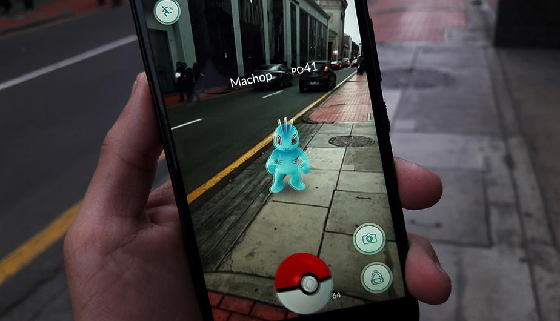

## Introducción

Esta plataforma permitirá almacenar y mostrar adecuadamente las actividades solicitadas en el curso de de **Data Science Machine Learning & Deep Learning** de la Universidad Nacional Agraria la Molina. 

## Top 10 Tendencias tecnológicas para el 2020

El 2020 será un año memorable, no solo por el contexto de la pandemia del COVID 19, sino también por los avances tecnológicos en muchos campos de la industria y la academia. En esta oportunidad describiré diez tecnologías que consideró que son resaltantes por el alcance que tendrán a futuro y cómo redifinirán el concepto de lo cotidiano. Mi investigación parte de dos artículos digitales presentados por la página [Medium](https://medium.com/@satyanageshan8/top-technology-trends-for-2020-13eb7a467279) y el área de divulgación de la BBC: [Science Focus](https://www.sciencefocus.com/future-technology/new-technology-trends-2020s/). Considero que ambos enfoques son pertinentas, ya que el primero representa la percepción de un usuario y bloguero tecnológico mientras que la segunda fui hecha por un medio de comunicación con la finalidad de llegar a un mayor público pero menos especializado.

### 1. Procesamiento de Lenguaje Natural (NLP) y reconocimiento de Voz

  

Controlar objetos con la voz y hacer que estos nos respondan son ya una realidad. Y es que esto es posible gracias a algoritmos tan simples como los chatbots hasta tecnologías más sofisticadas como los asistentes virtuales. Pero ahora el reto es que la máquina entienda y responda a través del **procesamiento del lenguaje natural o NLP**. 

Este algoritmo se basa en el uso de complejos algoritmos de IA retroalimentados con conversaciones entre humanos y ordenadores y gracias a este se podría entender el sarcasmo, los juegos de palabras y los contextos de doble significado típicos de una conversación humana.

En el 2018, Google dio un paso importante en esta área tras lanzar la aplicación [Duplex](https://ai.googleblog.com/2018/05/duplex-ai-system-for-natural-conversation.html). Este asistente permite hacer reservaciones en restaurantes o salones de belleza, ya sea de manera online o incluso con una llamada telefónica tan _humana_ que confundiría a más de uno. Sin embargo, tendía a presentar deficiencias que han sido corregidas durante estos años. 

Al día de hoy, Google sigue trabajando para incorporar el lenguaje natural a nuestras vidas. Y es que, en el 2020, el uso de tecnologías NLP en muchos servicios se ha incrementado y es mayor que años pasados.

### 2. Automatización robótica de procesos

  

La **automatización robótica de procesos** o [RPA](https://es.wikipedia.org/wiki/Automatizaci%C3%B3n_rob%C3%B3tica_de_procesos) es una forma naciente de automatización de los procesos industriales, gestión y negocios que replica las acciones de un ser humano interactuando con la interfaz de usuario de un sistema informático.

La RPA no es nueva y es considerada como un producto de la inteligencia artificial de poca complejidad. No obstante, es presentada como un “trending topic” en la mayoría de conferencias de tecnología e industria, lo cual dio pie a muchas inversiones para su desarrollo. Por lo que se piensa que en el 2020, se implementen tecnologías de RPA para crear y optimizar procesos que gestionen adecuadamente los recursos de una empresa de forma automática, estas empresas se conocen como empresas inteligentes.

Un ejemplo es [Cisco](https://es.slideshare.net/governmenttechnology/ny-dgs-19-presentation-robotic-process-automation) que ya está usando RPA para aumetar el valor de su fuerza laboral. 

### 3. Blockchain

  

El **blockchain** es una tecnología que descentraliza la gestión de las operaciones involucradas en una transacción de información, a través de una distribución de funciones en todos los eslabones de una cadena de bloques. Además, estos eslabones verifican las transacciones que validan finalmente la operación. Para entender mejor esta tecnología comparto la publicación de Javier Pastor en [Xataka](https://www.xataka.com/especiales/que-es-blockchain-la-explicacion-definitiva-para-la-tecnologia-mas-de-moda).

 Esta tecnología se ha ido popularizando desde la aparición de las criptomonedas como, por ejemplo, el Bitcoin. Sin embargo, a pesar que el uso de este a menguado debido a estrictas regulaciones del sistema monetario global.
 
Este año, Ahmed Banafa en una publicación para [OpenMind BBVA](https://www.bbvaopenmind.com/economia/finanzas/las-diez-tendencias-de-blockchain-en-2020/) analizó tendencias que dominarían la tecnología blockchain. Entre ellas resalto su uso para atajar problemas en redes sociales, su implementación en agencias gubernamentales y su aplicación en tecnologías IoT. 

### 4. Internet de las cosas (IoT) y Robótica en la nube

Según una publicación de [Hod Fleishman]( https://www.forbes.com/sites/hodfleishman/2020/01/07/its-2020-lets-stop-saying-iot/#2429af3f73dd), el concepto del **internet de las cosas o IoT** es más que solo la presencia de sensores embebidos en los dispositivos que pueden interconectarse a través de una red de internet. Involucra también la inferencia de la información y la respuesta adecuada ante una necesidad del usuario.

[Louis Columbus]( https://www.forbes.com/sites/louiscolumbus/2020/05/25/the-top-20-iot-startups-to-watch-in-2020/#2879af9b7697) muestra cifras que evidencian y justifican el crecimiento en el interés de desarrollar tecnologías IoT para el 2020 en el mundo:

| Descripción | Valor |
| --- | --- |
| Número de startups IoT creados (2019-2020) | **7328 /↑27%** |
| Inversión para startups IoT (Q1 2019- Q1 2020) | **$4.7K millones /↑15%** |
| Estimación del mercado de tecnologías IoT | **$72K-38K millones** |
| Estimación del crecimiento del mercado IoT (2019-2025)| **$302K millones/↑10.1%** |

Los startups IoT ofrecen diferentes servicios, como de seguridad, salud, domótica, entre otros. Es por ello que en los próximos años esta forme parte de nuestro día a día. 

Una de las tecnologías que involucra también el uso del IoT es **la robótica en la nube**. La robótica en la nube promete algo completamente nuevo; robots con súper cerebros almacenados en la nube en línea. La idea es que estos robots, con su influencia intelectual, serán más flexibles en los trabajos que realizan y los lugares donde pueden trabajar, tal vez incluso acelerando su llegada a nuestros hogares.

[Google Cloud](https://googlecloudrobotics.github.io/core/) y [Amazon Cloud](https://aws.amazon.com/es/robomaker/) tienen cerebros de robots que están aprendiendo y creciendo dentro de ellos. El sueño detrás de la robótica en la nube es crear robots que puedan ver, escuchar, comprender el lenguaje natural y comprender el mundo que los rodea.

### 5. Telecomunicaciones 5G

  

El [**5G**]( https://www.itu.int/web/pp-18/es/backgrounder/5g-fifth-generation-of-mobile-technologies) es un estándar de telecomunicaciones definido por la Unión Internacional de Telecomunicaciones (ITU). La cuál estable ciertos requisitos que debe cumplir la señal para ser considerada como tal: 

| Parámetro | Valor |
| --- | --- |
| Velocidad de descarga | **20 GB** |
| Tiempo de respuesta | **1 ms** |
| Dispositivos conectados por Km^2 | **1 000 000** |

A pesar de la paranoia creada el 2020 contra la tecnología 5G, la realidad es que esta tecnología será la base para la sociedad de la información e industria 4.0. Permitirá optimizar el rendimiento de las aplicaciones de la inteligencia artificial, el internet de las cosas, automatización, telemedicina, entre otras. 

### 6. Computación Cuántica

  

La computación cuántica es el uso computacional de los diferentes estados cuánticos presentes de átomos o partículas subatómicas, en condiciones muy específicas. Es decir utilizar más de dos estados analógicos para construir todo un sistema informático.

La computación cuántica ha dejado de ser un paradigma y se ha convertido en un realidad gracias a [IBM](https://www.ibm.com/quantum-computing/). La compañía lanzó el 8 de enero del 2019 la primera computadora cuántica *IBM Q System One* para uso comercial y de investigación. Entre sus clientes más notables se encuentran el CERN, ExxonMobil, Fermilab y los laboratorios de energía del Lawrence Berkeley National Laboratory. 

Por otro lado, Google también entró a la carrera con Sycamore su ordenador cuántico. El cuál incluso logró por primera vez la [supremacía cuántica](https://www.bbc.com/news/science-environment-50154993); es decir lograr resolver un trabajo en menor tiempo posible que la supercomputadora de IBM, la más potente del mundo.

Es de esperarse que los próximos años lleguen aplicaciones como para la cyber seguridad, investigación de sistemas complejos (ejm. climatológicos, moleculares o astronómicos) y gestión de recursos.

### 7. Analytics

  

**Analytics** juega un papel cada vez más importante en el crecimiento y la medición de las empresas en todo el mundo.
Los análisis no solo pueden decirle si tiene éxito en su mercado, sino que pueden ayudarlo a predecir hacia dónde se moverán los mercados a continuación. Esta, aunque aparentemente simple en la superficie, en realidad implica una cantidad significativa de procesamiento de datos para convertir grandes cantidades de datos sin procesar en algo útil y útil.

Con la computación en la nube, IoT y el crecimiento de big data, los datos se vuelven turbios y nublados. Se necesitarán herramientas de análisis que utilicen el aprendizaje automático en un grado mucho mayor que el implementado actualmente para dar sentido a los datos, identificar problemas e incluso recomendar acciones.

En esencia, Analytics es una especialidad en la que las tecnologías de inteligencia artificial y aprendizaje automático serán particularmente útiles. El análisis será el caso de uso perfecto para muchas de las tecnologías emergentes de la próxima década.

### 8. Realidad extendida, virtual, aumentada y mixta

  

La **realidad extendida** (RE) es un término general que cubre varias tecnologías nuevas y emergentes que se utilizan para crear experiencias digitales más inmersivas.

Más específicamente, se refiere a la realidad virtual, aumentada y mixta. La **realidad virtual** (RV) proporciona una experiencia totalmente inmersiva digitalmente en la que ingresa a un mundo generado por computadora utilizando auriculares que combinan el mundo real. La **realidad aumentada** (RA) superpone objetos digitales en el mundo real a través de pantallas o pantallas de teléfonos inteligentes (piense en los filtros de Snapchat).

La **realidad mixta** (RM) es una extensión de RA, lo que significa que los usuarios pueden interactuar con objetos digitales colocados en el mundo real (piense en tocar un piano holográfico que haya colocado en su habitación con un auricular RA).

Estas tecnologías han existido durante algunos años, pero se han limitado en gran medida al mundo del entretenimiento, con los auriculares Oculus Rift y Vive que proporcionan lo último en videojuegos y las características de los teléfonos inteligentes, como filtros de cámara y Pokemon Go. juegos de estilo que proporcionan los ejemplos más visibles de RA.

A partir de 2020, espera que todo eso cambie, a medida que las empresas se familiaricen con la gran cantidad de posibilidades emocionantes que ofrecen ambas formas actuales de ER. La realidad virtual y aumentada prevalecerá cada vez más para la capacitación y la simulación, además de ofrecer nuevas formas de interactuar con los clientes.

### 9. Impresión 3D

  

Si su trabajo implica diseño, es posible que pronto se encuentre con una impresora 3-D en su escritorio.

La tecnología crea objetos tridimensionales al agregar material, como plástico, capa por capa, basado en un diseño generado por computadora hasta que se haya formado un objeto.

Permite a los diseñadores crear rápidamente prototipos de conceptos directamente en sus escritorios, lo que significa iteraciones de prototipos más rápidas y una mejor oportunidad de detectar errores de diseño desde el principio.

También significa que pueden crear objetos personalizados, como prótesis, mucho más baratos que la fabricación convencional.

### 10. Edición Genética con CRISPR

  

