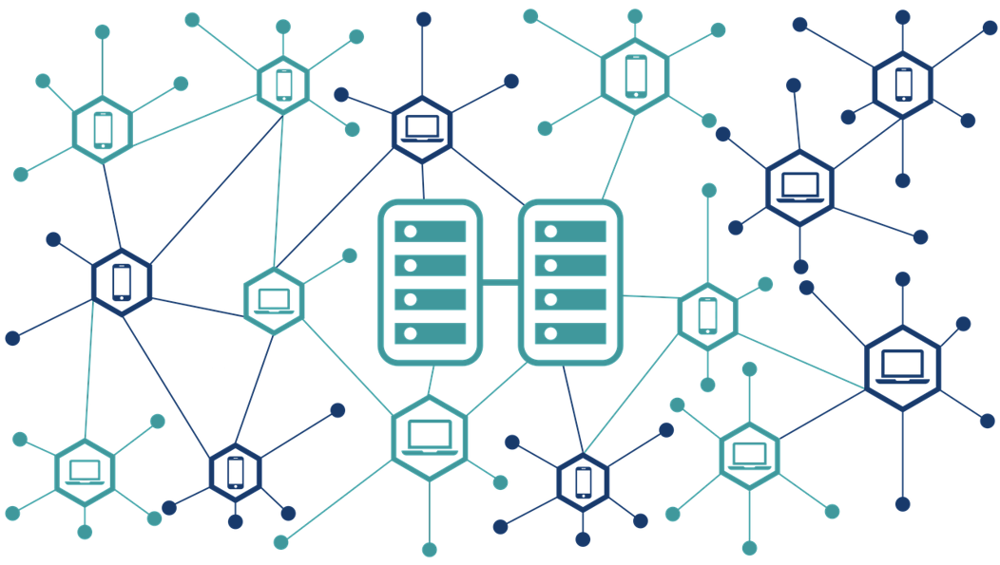
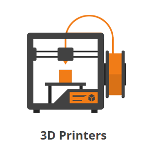

## Introducción

Esta plataforma permitirá almacenar y mostrar adecuadamente las actividades solicitadas en el curso de de **Data Science Machine Learning & Deep Learning** de la Universidad Nacional Agraria la Molina. 

## Top 10 Tendencias tecnológicas para el 2020


El 2020 es un año será un año memorable, no solo por el contexto de la pandemia del COVID 19, sino también por los avances tecnológicos en muchos campos de la industria y la academia. En esta oportunidad describiré diez de ellas que consideró más resaltantes por el nivel de impacto y alcance que tendrán a futuro. Mi investigación parte de dos artículos digitales presentados por la página [Medium](https://medium.com/@satyanageshan8/top-technology-trends-for-2020-13eb7a467279) y el área de divulgación de la BBC: [Science Focus](https://www.sciencefocus.com/future-technology/new-technology-trends-2020s/). Considero que ambos enfoques son complementarios, ya que representan las perspectivas de los usuarios tecnológicos y la de un medio de comunicación respectivamente. 


### 1. Procesamiento de Lenguaje Natural (NLP) y reconocimiento de Voz
<p align="center">
  
</p>


### 2. Automatización y RPA
[JupyterNotebook](https://github.com/DanJoshuaSG/DataScience_DanSG/blob/master/Texts_Plot.ipynb) 
<p align="center">
  
</p>


### 3. Blockchain
<p align="center">
  
</p>

### 4. Internet de las cosas (IoT)
<p align="center">

</p>

### 5. Telecomunicaciones 5G
<p align="center">
  
</p>

### 6. Computación Cuántica
<p align="center">
  
</p>

### 7. Analytics
<p align="center">
  
</p>

### 8. Realidad Virtual o Expandida
<p align="center">
  
</p>

### 9. Impresión 3D
<p align="center">
  
</p>
### 10. Edición Genética con CRISPR
<p align="center">
  
</p>
### Organismos biológicos progamables
<p align="center">
  
</p>
### Markdown

Markdown is a lightweight and easy-to-use syntax for styling your writing. It includes conventions for

```markdown
Syntax highlighted code block

# COMPILACIÓN
## Header 2
### Header 3

- Bulleted
- List

1. Numbered
2. List

**Bold** and _Italic_ and `Code` text

[Link](url) and 
```

For more details see [GitHub Flavored Markdown](https://guides.github.com/features/mastering-markdown/).

### Jekyll Themes

Your Pages site will use the layout and styles from the Jekyll theme you have selected in your [repository settings](https://github.com/DanJoshuaSG/Homework_DSML_UNALM_Dan/settings). The name of this theme is saved in the Jekyll `_config.yml` configuration file.

### Support or Contact

Having trouble with Pages? Check out our [documentation](https://help.github.com/categories/github-pages-basics/) or [contact support](https://github.com/contact) and we’ll help you sort it out.
